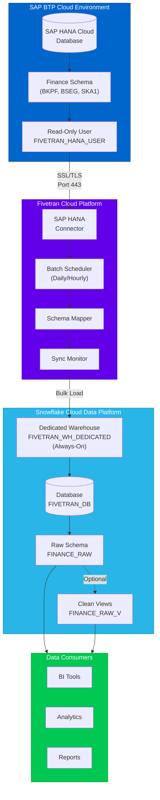
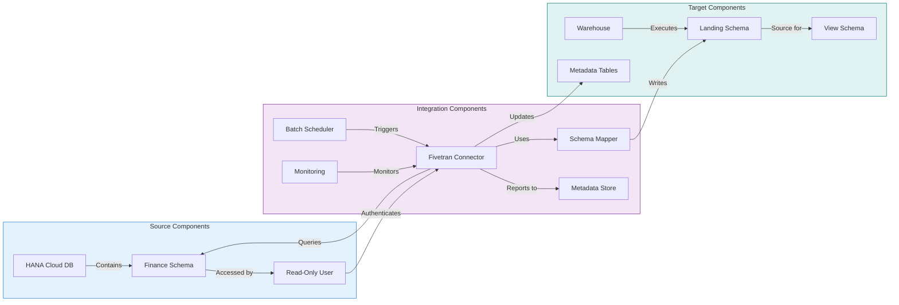
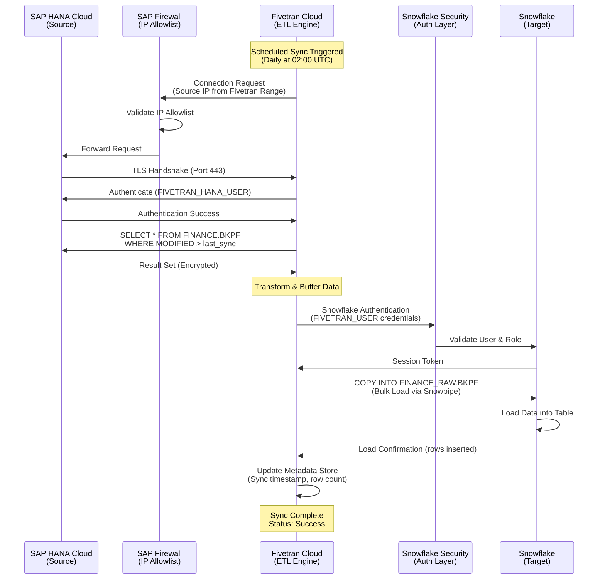
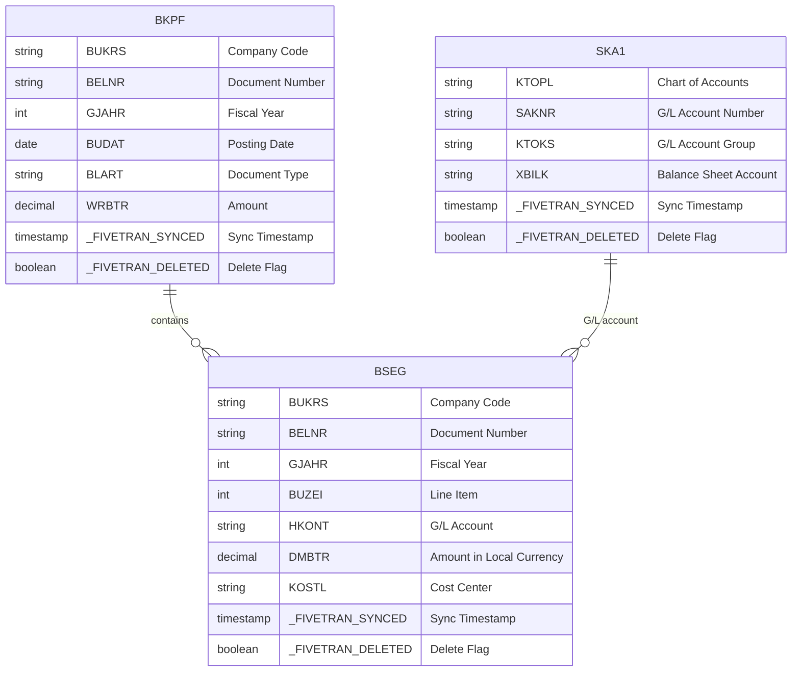
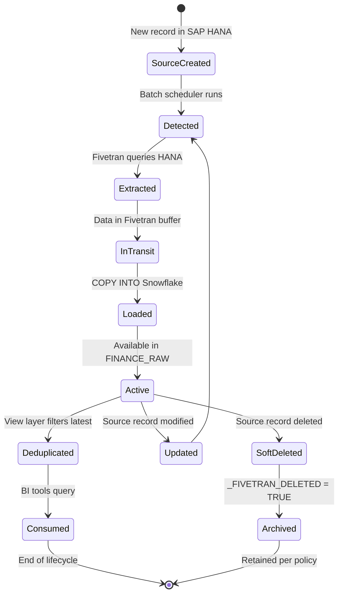
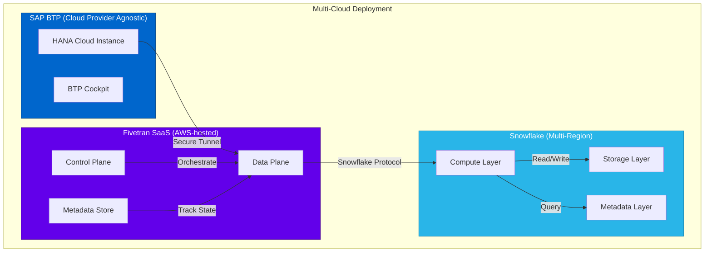
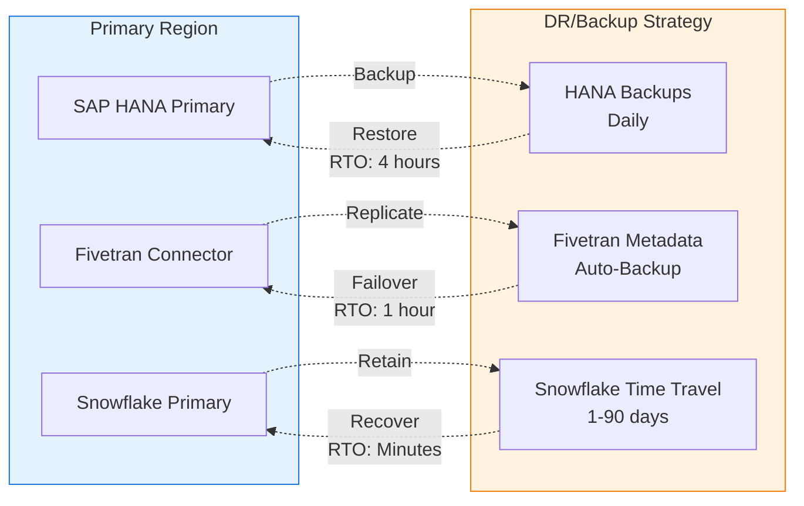
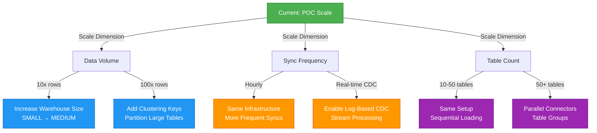

# System Architecture Documentation
## SAP BTP to Snowflake Data Integration Pipeline

**Project Type:** Batch-based ETL Data Integration  
**Documentation Version:** 1.0  
**Author:** Research Student Implementation  
**Date:** October 2025

---

## Table of Contents
1. [Architecture Overview](#architecture-overview)
2. [Component Architecture](#component-architecture)
3. [Network Architecture](#network-architecture)
4. [Data Architecture](#data-architecture)
5. [Security Architecture](#security-architecture)
6. [Deployment Architecture](#deployment-architecture)

---

## Architecture Overview

### High-Level System Architecture (Mermaid)



### Three-Tier Architecture (ASCII)

```
┌─────────────────────────────────────────────────────────────────────────┐
│                         TIER 1: SOURCE LAYER                            │
│                         (SAP BTP - HANA Cloud)                          │
├─────────────────────────────────────────────────────────────────────────┤
│                                                                         │
│  ┌───────────────────────────────────────────────────────────────┐    │
│  │  SAP HANA Cloud Database Instance                             │    │
│  │                                                                │    │
│  │  ┌────────────────────────────────────────────────────────┐  │    │
│  │  │  FINANCE Schema                                         │  │    │
│  │  │  ├── BKPF (Document Headers)          ~2M rows         │  │    │
│  │  │  ├── BSEG (Line Items)                ~15M rows        │  │    │
│  │  │  ├── SKA1 (G/L Master)                ~5K rows         │  │    │
│  │  │  └── Custom Views                     Variable          │  │    │
│  │  └────────────────────────────────────────────────────────┘  │    │
│  │                                                                │    │
│  │  Access Control:                                               │    │
│  │  • User: FIVETRAN_HANA_USER                                   │    │
│  │  • Privilege: SELECT only (read-only)                         │    │
│  │  • Authentication: Password-based                             │    │
│  │  • Connection: SSL/TLS encrypted                              │    │
│  └───────────────────────────────────────────────────────────────┘    │
│                                                                         │
└────────────────────────────┬────────────────────────────────────────────┘
                             │
                             │ Secure Connection
                             │ Protocol: JDBC over SSL (Port 443)
                             │ Direction: Pull-based (Fivetran initiates)
                             ▼
┌─────────────────────────────────────────────────────────────────────────┐
│                    TIER 2: INTEGRATION LAYER                            │
│                        (Fivetran Platform)                              │
├─────────────────────────────────────────────────────────────────────────┤
│                                                                         │
│  ┌──────────────────────┐    ┌──────────────────────┐                 │
│  │  SAP HANA Connector  │    │  Snowflake Writer    │                 │
│  │  ┌─────────────────┐ │    │  ┌─────────────────┐ │                 │
│  │  │ Connection Mgr  │ │    │  │ Bulk Loader     │ │                 │
│  │  │ Query Executor  │ │    │  │ Type Mapper     │ │                 │
│  │  │ Schema Reader   │ │    │  │ Error Handler   │ │                 │
│  │  └─────────────────┘ │    │  └─────────────────┘ │                 │
│  └──────────────────────┘    └──────────────────────┘                 │
│             │                            ▲                              │
│             │                            │                              │
│             ▼                            │                              │
│  ┌────────────────────────────────────────────────────────┐           │
│  │           Orchestration Engine                          │           │
│  │  ┌────────────────┐  ┌────────────────┐  ┌──────────┐ │           │
│  │  │ Batch Scheduler│  │ State Manager  │  │ Metadata │ │           │
│  │  │ • Daily sync   │  │ • Track syncs  │  │ Store    │ │           │
│  │  │ • Hourly option│  │ • Incremental  │  │          │ │           │
│  │  └────────────────┘  └────────────────┘  └──────────┘ │           │
│  └────────────────────────────────────────────────────────┘           │
│                                                                         │
└────────────────────────────┬────────────────────────────────────────────┘
                             │
                             │ Snowflake Native Protocol
                             │ Direction: Push-based (Fivetran writes)
                             ▼
┌─────────────────────────────────────────────────────────────────────────┐
│                     TIER 3: TARGET LAYER                                │
│                  (Snowflake Data Warehouse)                             │
├─────────────────────────────────────────────────────────────────────────┤
│                                                                         │
│  ┌──────────────────────────────────────────────────────────────┐     │
│  │  Compute Layer                                                │     │
│  │  ┌──────────────────────────────────────────────────────┐    │     │
│  │  │  FIVETRAN_WH_DEDICATED (Virtual Warehouse)           │    │     │
│  │  │  • Size: SMALL (1 credit/hour)                       │    │     │
│  │  │  • Auto Suspend: 0 (Always On)                       │    │     │
│  │  │  • Auto Resume: TRUE                                 │    │     │
│  │  │  • Concurrency: 8 concurrent queries max             │    │     │
│  │  └──────────────────────────────────────────────────────┘    │     │
│  └──────────────────────────────────────────────────────────────┘     │
│                              │                                          │
│                              ▼                                          │
│  ┌──────────────────────────────────────────────────────────────┐     │
│  │  Storage Layer (FIVETRAN_DB Database)                        │     │
│  │                                                               │     │
│  │  ┌────────────────────────────────────────────────────────┐ │     │
│  │  │  FINANCE_RAW (Landing Zone Schema)                     │ │     │
│  │  │  ├── BKPF                                              │ │     │
│  │  │  │   ├── Business Columns (from source)               │ │     │
│  │  │  │   ├── _FIVETRAN_SYNCED (metadata)                  │ │     │
│  │  │  │   └── _FIVETRAN_DELETED (soft delete flag)         │ │     │
│  │  │  ├── BSEG                                              │ │     │
│  │  │  ├── SKA1                                              │ │     │
│  │  │  └── Additional Tables                                 │ │     │
│  │  └────────────────────────────────────────────────────────┘ │     │
│  │                                                               │     │
│  │  ┌────────────────────────────────────────────────────────┐ │     │
│  │  │  FINANCE_RAW_V (Clean Views Schema) - Optional        │ │     │
│  │  │  ├── BKPF_CLEAN (deduplicated)                        │ │     │
│  │  │  ├── BSEG_CLEAN (deduplicated)                        │ │     │
│  │  │  └── Business Logic Views                              │ │     │
│  │  └────────────────────────────────────────────────────────┘ │     │
│  └──────────────────────────────────────────────────────────────┘     │
│                                                                         │
└─────────────────────────────────────────────────────────────────────────┘
```

---

## Component Architecture

### Component Interaction Diagram (Mermaid)



### Component Details (ASCII)

```
┌─────────────────────────────────────────────────────────────────┐
│                    COMPONENT BREAKDOWN                          │
└─────────────────────────────────────────────────────────────────┘

┌──────────────────────────────────────────────────────────────────┐
│ 1. SOURCE COMPONENTS (SAP BTP)                                   │
├──────────────────────────────────────────────────────────────────┤
│                                                                  │
│  [A] SAP HANA Cloud Database                                     │
│      • Type: In-memory columnar database                         │
│      • Hosting: SAP BTP Cloud Infrastructure                     │
│      • Version: HANA Cloud 2.x                                   │
│      • Purpose: Operational data store for finance transactions  │
│                                                                  │
│  [B] Finance Schema (FINANCE)                                    │
│      • Tables: BKPF, BSEG, SKA1                                  │
│      • Views: Custom reporting/calculation views                 │
│      • Purpose: Business logic and data organization             │
│                                                                  │
│  [C] Database User (FIVETRAN_HANA_USER)                          │
│      • Type: Database technical user                             │
│      • Privileges: SELECT only (read-only)                       │
│      • Authentication: Password-based                            │
│      • Purpose: Secure access for data extraction                │
│                                                                  │
└──────────────────────────────────────────────────────────────────┘

┌──────────────────────────────────────────────────────────────────┐
│ 2. INTEGRATION COMPONENTS (Fivetran)                             │
├──────────────────────────────────────────────────────────────────┤
│                                                                  │
│  [D] SAP HANA Connector                                          │
│      • Type: Pre-built Fivetran connector                        │
│      • Protocol: JDBC over SSL                                   │
│      • Mode: Batch pull                                          │
│      • Features:                                                 │
│        - Automatic schema detection                              │
│        - Incremental sync support                                │
│        - Type mapping (HANA → Snowflake)                         │
│                                                                  │
│  [E] Batch Scheduler                                             │
│      • Frequency Options: Hourly, Daily, Weekly                  │
│      • Current Config: Daily                                     │
│      • Trigger: Time-based (configurable)                        │
│      • Purpose: Orchestrate sync cycles                          │
│                                                                  │
│  [F] Schema Mapper                                               │
│      • Function: Data type conversion                            │
│      • Mapping:                                                  │
│        HANA VARCHAR → Snowflake VARCHAR                          │
│        HANA DECIMAL → Snowflake NUMBER                           │
│        HANA DATE → Snowflake DATE                                │
│        HANA TIMESTAMP → Snowflake TIMESTAMP_NTZ                  │
│                                                                  │
│  [G] Metadata Store                                              │
│      • Tracks: Sync history, schema versions                     │
│      • State Management: Last sync timestamp, row counts         │
│      • Purpose: Incremental sync enablement                      │
│                                                                  │
│  [H] Monitoring & Alerting                                       │
│      • Metrics: Sync duration, rows synced, errors               │
│      • Alerts: Email/Slack on failures                           │
│      • Dashboard: Web-based sync status view                     │
│                                                                  │
└──────────────────────────────────────────────────────────────────┘

┌──────────────────────────────────────────────────────────────────┐
│ 3. TARGET COMPONENTS (Snowflake)                                 │
├──────────────────────────────────────────────────────────────────┤
│                                                                  │
│  [I] Virtual Warehouse (FIVETRAN_WH_DEDICATED)                   │
│      • Size: SMALL (4 servers, 16GB RAM total)                   │
│      • Cost: ~1 credit/hour = $2-4/hour (varies by region)       │
│      • Auto Suspend: Disabled (0 = always on)                    │
│      • Purpose: Dedicated compute for data loading               │
│      • Characteristics:                                          │
│        - No cold start delays                                    │
│        - Consistent performance                                  │
│        - Isolated from query workloads                           │
│                                                                  │
│  [J] Database (FIVETRAN_DB)                                      │
│      • Type: Snowflake database object                           │
│      • Purpose: Logical container for schemas                    │
│      • Storage: Unlimited (pay per TB stored)                    │
│                                                                  │
│  [K] Landing Schema (FINANCE_RAW)                                │
│      • Tables: Mirror of source tables                           │
│      • Metadata Columns:                                         │
│        - _FIVETRAN_SYNCED: Load timestamp                        │
│        - _FIVETRAN_DELETED: Soft delete flag                     │
│      • Purpose: Immutable raw data store                         │
│                                                                  │
│  [L] Clean Views Schema (FINANCE_RAW_V)                          │
│      • Type: Views on raw tables                                 │
│      • Transformations:                                          │
│        - Deduplication by business key                           │
│        - Data type casting                                       │
│        - NULL handling                                           │
│      • Purpose: Consumption-ready data                           │
│                                                                  │
│  [M] Access Control Components                                   │
│      • User: FIVETRAN_USER                                       │
│      • Role: FIVETRAN_ROLE                                       │
│      • Grants: Limited to FIVETRAN_DB only                       │
│      • Purpose: Principle of least privilege                     │
│                                                                  │
└──────────────────────────────────────────────────────────────────┘
```

---

## Network Architecture

### Network Flow Diagram (Mermaid)



### Network Topology (ASCII)

```
                    INTERNET / CLOUD BACKBONE
                              │
        ┌─────────────────────┼─────────────────────┐
        │                     │                     │
        ▼                     ▼                     ▼
┌───────────────┐   ┌──────────────────┐   ┌──────────────┐
│  SAP BTP      │   │    FIVETRAN      │   │  SNOWFLAKE   │
│  (Source)     │   │  (Integration)   │   │   (Target)   │
├───────────────┤   ├──────────────────┤   ├──────────────┤
│               │   │                  │   │              │
│  ┌─────────┐  │   │  ┌────────────┐ │   │  ┌────────┐  │
│  │ HANA DB │  │   │  │ Connector  │ │   │  │ Account│  │
│  │         │  │   │  │ Services   │ │   │  │ Region │  │
│  └────┬────┘  │   │  └─────┬──────┘ │   │  └───┬────┘  │
│       │       │   │        │        │   │      │       │
│  ┌────▼────┐  │   │  ┌─────▼──────┐ │   │  ┌───▼────┐  │
│  │Firewall │  │   │  │   Router   │ │   │  │Security│  │
│  │IP Allow │  │   │  │            │ │   │  │ Layer  │  │
│  └────┬────┘  │   │  └─────┬──────┘ │   │  └───┬────┘  │
│       │       │   │        │        │   │      │       │
└───────┼───────┘   └────────┼────────┘   └──────┼───────┘
        │                    │                   │
        │ Port: 443          │ Port: 443         │
        │ Protocol: SSL/TLS  │ Protocol: HTTPS   │
        │ Direction: Inbound │ Direction:Outbound│
        │                    │                   │
        └──────────►┌────────▼────────┐◄─────────┘
                    │                 │
                    │  Fivetran       │
                    │  Orchestrator   │
                    │                 │
                    │  IP Ranges:     │
                    │  • 52.xx.xx.xx  │
                    │  • 34.xx.xx.xx  │
                    │  (Region-based) │
                    │                 │
                    └─────────────────┘

┌──────────────────────────────────────────────────────────────┐
│  NETWORK SECURITY CONFIGURATION                              │
├──────────────────────────────────────────────────────────────┤
│                                                              │
│  SAP BTP Firewall Rules:                                     │
│  ┌────────────────────────────────────────────────────┐     │
│  │ Source IP Range    │ Port │ Protocol │ Direction   │     │
│  ├────────────────────┼──────┼──────────┼─────────────┤     │
│  │ Fivetran IPs       │ 443  │ TLS 1.2+ │ Inbound     │     │
│  │ (Region-specific)  │      │          │ Allow       │     │
│  └────────────────────────────────────────────────────┘     │
│                                                              │
│  Snowflake Security:                                         │
│  ┌────────────────────────────────────────────────────┐     │
│  │ Authentication: User/Password + Role                │     │
│  │ IP Restrictions: None (handled by user auth)        │     │
│  │ Network Policy: Default (all IPs allowed)           │     │
│  │ MFA: Optional (not required for service accounts)   │     │
│  └────────────────────────────────────────────────────┘     │
│                                                              │
└──────────────────────────────────────────────────────────────┘
```

---

## Data Architecture

### Data Model Architecture (Mermaid)



### Data Flow Architecture (ASCII)

```
┌──────────────────────────────────────────────────────────────────────┐
│                     DATA FLOW ARCHITECTURE                           │
└──────────────────────────────────────────────────────────────────────┘

STAGE 1: SOURCE DATA (SAP HANA)
═══════════════════════════════════════
┌─────────────────────────────────────┐
│  FINANCE.BKPF (Document Headers)    │
│  Columns: 50+                       │
│  Rows: ~2,000,000                   │
│  Size: ~500 MB                      │
│  Update Pattern: Append + Update    │
└──────────────┬──────────────────────┘
               │
               │ Extraction Query:
               │ SELECT * FROM FINANCE.BKPF
               │ WHERE MODIFIED_AT > :last_sync
               │
               ▼
STAGE 2: IN-FLIGHT TRANSFORMATION (Fivetran)
═══════════════════════════════════════════════
┌─────────────────────────────────────┐
│  Fivetran Processing Buffer         │
│  • Data Type Mapping                │
│  • UTF-8 Encoding                   │
│  • Null Handling                    │
│  • Add Metadata Columns:            │
│    - _FIVETRAN_SYNCED               │
│    - _FIVETRAN_DELETED              │
└──────────────┬──────────────────────┘
               │
               │ Bulk Load Protocol:
               │ COPY INTO ... FROM @STAGE
               │
               ▼
STAGE 3: LANDING ZONE (Snowflake Raw)
═══════════════════════════════════════
┌─────────────────────────────────────┐
│  FINANCE_RAW.BKPF (Raw Table)       │
│  Columns: 52 (50 + 2 metadata)      │
│  Rows: ~2,000,000 (cumulative)      │
│  Size: ~600 MB (with metadata)      │
│  Clustering: None (unoptimized)     │
│  Purpose: Immutable audit trail     │
└──────────────┬──────────────────────┘
               │
               │ View Definition:
               │ SELECT *, ROW_NUMBER() OVER (
               │   PARTITION BY BELNR 
               │   ORDER BY _FIVETRAN_SYNCED DESC
               │ ) as rn
               │
               ▼
STAGE 4: CLEAN LAYER (Snowflake Views)
═══════════════════════════════════════
┌─────────────────────────────────────┐
│  FINANCE_RAW_V.BKPF_CLEAN (View)    │
│  Transformations:                   │
│  • Deduplication by BELNR           │
│  • Filter: rn = 1                   │
│  • Latest version only              │
│  • Type casting (if needed)         │
│  Purpose: Consumption-ready         │
└──────────────┬──────────────────────┘
               │
               │ Query by BI Tools:
               │ SELECT * FROM 
               │ FINANCE_RAW_V.BKPF_CLEAN
               │ WHERE BUDAT >= '2025-01-01'
               │
               ▼
STAGE 5: CONSUMPTION (Analytics/BI)
════════════════════════════════════════
┌─────────────────────────────────────┐
│  Data Consumers                     │
│  • Tableau / Power BI               │
│  • Custom SQL queries               │
│  • Snowflake ML models              │
│  • Export jobs                      │
└─────────────────────────────────────┘
```

### Data Lifecycle Management (Mermaid)



---

## Security Architecture

### Security Layers (ASCII)

```
┌──────────────────────────────────────────────────────────────────┐
│                    SECURITY ARCHITECTURE                         │
│                      (Defense in Depth)                          │
└──────────────────────────────────────────────────────────────────┘

LAYER 1: NETWORK SECURITY
══════════════════════════
┌────────────────────────────────────────────────────────┐
│  SAP BTP Network Controls                              │
│  ┌──────────────────────────────────────────────┐     │
│  │ • IP Allowlisting (Fivetran IP ranges)       │     │
│  │ • TLS 1.2+ encryption mandatory              │     │
│  │ • Port 443 only (no plain HTTP)              │     │
│  │ • Connection timeout: 30 seconds             │     │
│  └──────────────────────────────────────────────┘     │
│                                                        │
│  Snowflake Network Controls                            │
│  ┌──────────────────────────────────────────────┐     │
│  │ • Network policies (optional)                │     │
│  │ • VPC endpoints (not used in this POC)       │     │
│  │ • TLS encryption for all connections         │     │
│  └──────────────────────────────────────────────┘     │
└────────────────────────────────────────────────────────┘

LAYER 2: AUTHENTICATION
═══════════════════════════
┌────────────────────────────────────────────────────────┐
│  SAP HANA Authentication                               │
│  ┌──────────────────────────────────────────────┐     │
│  │ User: FIVETRAN_HANA_USER                     │     │
│  │ Method: Database password authentication     │     │
│  │ Password Policy:                             │     │
│  │   • Minimum 12 characters                    │     │
│  │   • Complexity required (upper/lower/digit)  │     │
│  │   • Rotation: 90 days (recommended)          │     │
│  │ Session timeout: 24 hours                    │     │
│  └──────────────────────────────────────────────┘     │
│                                                        │
│  Snowflake Authentication                              │
│  ┌──────────────────────────────────────────────┐     │
│  │ User: FIVETRAN_USER                          │     │
│  │ Method: Username + Password                  │     │
│  │ MFA: Not enabled (service account)           │     │
│  │ Key-pair auth: Not used (can be upgraded)    │     │
│  │ Session timeout: 4 hours (default)           │     │
│  └──────────────────────────────────────────────┘     │
└────────────────────────────────────────────────────────┘

LAYER 3: AUTHORIZATION
══════════════════════════
┌────────────────────────────────────────────────────────┐
│  SAP HANA Privileges                                   │
│  ┌──────────────────────────────────────────────┐     │
│  │ FIVETRAN_HANA_USER:                          │     │
│  │   GRANT SELECT ON SCHEMA FINANCE             │     │
│  │   (Read-only access)                         │     │
│  │                                              │     │
│  │ Denied Privileges:                           │     │
│  │   • INSERT, UPDATE, DELETE                   │     │
│  │   • CREATE, ALTER, DROP                      │     │
│  │   • EXECUTE procedures                       │     │
│  │   • System privileges                        │     │
│  └──────────────────────────────────────────────┘     │
│                                                        │
│  Snowflake RBAC Model                                  │
│  ┌──────────────────────────────────────────────┐     │
│  │ Role Hierarchy:                              │     │
│  │   ACCOUNTADMIN (system admin)                │     │
│  │        └─ FIVETRAN_ROLE (limited scope)      │     │
│  │                                              │     │
│  │ FIVETRAN_ROLE Grants:                        │     │
│  │   • USAGE on FIVETRAN_WH_DEDICATED           │     │
│  │   • USAGE on FIVETRAN_DB                     │     │
│  │   • CREATE TABLE on FINANCE_RAW              │     │
│  │   • CREATE VIEW on FINANCE_RAW               │     │
│  │                                              │     │
│  │ No access to:                                │     │
│  │   • Other databases                          │     │
│  │   • System functions                         │     │
│  │   • Account management                       │     │
│  └──────────────────────────────────────────────┘     │
└────────────────────────────────────────────────────────┘

LAYER 4: DATA ENCRYPTION
════════════════════════════
┌────────────────────────────────────────────────────────┐
│  In Transit                                            │
│  ┌──────────────────────────────────────────────┐     │
│  │ SAP HANA → Fivetran:                         │     │
│  │   • TLS 1.2+ (mandatory)                     │     │
│  │   • Certificate validation                   │     │
│  │                                              │     │
│  │ Fivetran → Snowflake:                        │     │
│  │   • TLS 1.2+ (mandatory)                     │     │
│  │   • Snowflake-issued certificates            │     │
│  └──────────────────────────────────────────────┘     │
│                                                        │
│  At Rest                                               │
│  ┌──────────────────────────────────────────────┐     │
│  │ SAP HANA:                                    │     │
│  │   • Data volumes encrypted                   │     │
│  │   • Encryption: AES-256                      │     │
│  │   • Key management: SAP-managed              │     │
│  │                                              │     │
│  │ Snowflake:                                   │     │
│  │   • All data encrypted by default            │     │
│  │   • Encryption: AES-256                      │     │
│  │   • Key management: Snowflake-managed        │     │
│  │   • Key rotation: Automatic (30 days)        │     │
│  └──────────────────────────────────────────────┘     │
└────────────────────────────────────────────────────────┘

LAYER 5: AUDIT & MONITORING
════════════════════════════════
┌────────────────────────────────────────────────────────┐
│  Audit Trails                                          │
│  ┌──────────────────────────────────────────────┐     │
│  │ Fivetran Logs:                               │     │
│  │   • All sync activities logged               │     │
│  │   • Failed connection attempts               │     │
│  │   • Row counts per sync                      │     │
│  │   • Retention: 30 days                       │     │
│  │                                              │     │
│  │ Snowflake Query History:                     │     │
│  │   • All queries logged                       │     │
│  │   • User/Role attribution                    │     │
│  │   • Data access tracking                     │     │
│  │   • Retention: 365 days                      │     │
│  └──────────────────────────────────────────────┘     │
│                                                        │
│  Monitoring Alerts                                     │
│  ┌──────────────────────────────────────────────┐     │
│  │ • Failed sync attempts                       │     │
│  │ • Unusual data volumes                       │     │
│  │ • Authentication failures                    │     │
│  │ • Schema changes detected                    │     │
│  │ Notification: Email/Slack                    │     │
│  └──────────────────────────────────────────────┘     │
└────────────────────────────────────────────────────────┘
```

### Security Threat Model (Mermaid)

```mermaid
graph TD
    A[Threat: Unauthorized Data Access] -->|Mitigation| B[Read-Only User]
    A -->|Mitigation| C[IP Allowlisting]
    A -->|Mitigation| D[TLS Encryption]
    
    E[Threat: Credential Compromise] -->|Mitigation| F[Password Complexity]
    E -->|Mitigation| G[Password Rotation]
    E -->|Mitigation| H[Least Privilege]
    
    I[Threat: Data in Transit Interception] -->|Mitigation| J[TLS 1.2+]
    I -->|Mitigation| K[Certificate Validation]
    
    L[Threat: Unauthorized Modifications] -->|Mitigation| M[SELECT Only Grants]
    L -->|Mitigation| N[Immutable Raw Tables]
    
    O[Threat: Data Exfiltration] -->|Detection| P[Audit Logs]
    O -->|Detection| Q[Monitoring Alerts]
    
    style A fill:#ff6b6b,stroke:#c92a2a,color:#fff
    style E fill:#ff6b6b,stroke:#c92a2a,color:#fff
    style I fill:#ff6b6b,stroke:#c92a2a,color:#fff
    style L fill:#ff6b6b,stroke:#c92a2a,color:#fff
    style O fill:#ff6b6b,stroke:#c92a2a,color:#fff
    
    style B fill:#51cf66,stroke:#2f9e44,color:#fff
    style C fill:#51cf66,stroke:#2f9e44,color:#fff
    style D fill:#51cf66,stroke:#2f9e44,color:#fff
    style F fill:#51cf66,stroke:#2f9e44,color:#fff
    style G fill:#51cf66,stroke:#2f9e44,color:#fff
    style H fill:#51cf66,stroke:#2f9e44,color:#fff
    style J fill:#51cf66,stroke:#2f9e44,color:#fff
    style K fill:#51cf66,stroke:#2f9e44,color:#fff
    style M fill:#51cf66,stroke:#2f9e44,color:#fff
    style N fill:#51cf66,stroke:#2f9e44,color:#fff
    style P fill:#51cf66,stroke:#2f9e44,color:#fff
    style Q fill:#51cf66,stroke:#2f9e44,color:#fff
```



---

## Deployment Architecture

### Deployment Model (Mermaid)



### Infrastructure Overview (ASCII)

```
┌──────────────────────────────────────────────────────────────────┐
│                  DEPLOYMENT INFRASTRUCTURE                       │
└──────────────────────────────────────────────────────────────────┘

┌────────────────────────────────────────────────────────────────────┐
│ COMPONENT 1: SAP BTP (Source Infrastructure)                      │
├────────────────────────────────────────────────────────────────────┤
│                                                                    │
│  Deployment Model: Cloud-Native SaaS                               │
│  ├─ Cloud Provider: AWS/Azure/GCP (abstracted by SAP)             │
│  ├─ Region: Customer-selected (e.g., eu-central-1)                │
│  ├─ High Availability: Multi-AZ deployment                        │
│  └─ Backup: Automated daily backups                               │
│                                                                    │
│  HANA Cloud Instance:                                              │
│  ├─ Size: Production (configurable)                               │
│  ├─ Memory: 32GB - 1TB+ (scalable)                                │
│  ├─ Storage: 120GB - 6TB+ (scalable)                              │
│  ├─ Compute: 2-32+ vCPUs                                           │
│  └─ SLA: 99.5% uptime                                              │
│                                                                    │
│  Estimated Cost (HANA Cloud):                                      │
│  └─ $0.90 - $3.00/hour (depends on size)                          │
│                                                                    │
└────────────────────────────────────────────────────────────────────┘

┌────────────────────────────────────────────────────────────────────┐
│ COMPONENT 2: Fivetran (Integration Infrastructure)                │
├────────────────────────────────────────────────────────────────────┤
│                                                                    │
│  Deployment Model: Fully-Managed SaaS                              │
│  ├─ Cloud Provider: AWS (Fivetran-managed)                        │
│  ├─ Region: Multi-region (closest to source/target)               │
│  ├─ High Availability: Built-in redundancy                        │
│  └─ Maintenance: Zero-downtime updates                             │
│                                                                    │
│  Infrastructure Details:                                           │
│  ├─ Connector Instances: Auto-scaling                             │
│  ├─ Buffer Storage: Ephemeral (in-memory + temp S3)               │
│  ├─ Metadata Store: PostgreSQL (managed)                          │
│  └─ Monitoring: Datadog/CloudWatch                                │
│                                                                    │
│  Pricing Model:                                                    │
│  ├─ Billing: Based on Monthly Active Rows (MAR)                   │
│  ├─ MAR = Unique rows modified/inserted per month                 │
│  └─ Estimated: $0.001 - $0.003 per MAR                            │
│                                                                    │
│  Example Cost Calculation:                                         │
│  └─ 10M rows synced monthly = $10,000 - $30,000/month             │
│      (varies by plan tier)                                         │
│                                                                    │
└────────────────────────────────────────────────────────────────────┘

┌────────────────────────────────────────────────────────────────────┐
│ COMPONENT 3: Snowflake (Target Infrastructure)                    │
├────────────────────────────────────────────────────────────────────┤
│                                                                    │
│  Deployment Model: Cloud-Native Data Platform                      │
│  ├─ Cloud Provider: AWS/Azure/GCP (customer choice)               │
│  ├─ Region: Customer-selected (e.g., us-east-1)                   │
│  ├─ High Availability: Cross-AZ by default                        │
│  └─ Disaster Recovery: Cross-region replication (optional)        │
│                                                                    │
│  Compute (Virtual Warehouse):                                      │
│  ┌──────────┬──────────┬──────────────┬──────────────────┐       │
│  │ Size     │ Servers  │ Memory       │ Credits/Hour     │       │
│  ├──────────┼──────────┼──────────────┼──────────────────┤       │
│  │ X-SMALL  │ 1        │ 8 GB         │ 1                │       │
│  │ SMALL    │ 2        │ 16 GB        │ 2                │       │
│  │ MEDIUM   │ 4        │ 32 GB        │ 4                │       │
│  │ LARGE    │ 8        │ 64 GB        │ 8                │       │
│  └──────────┴──────────┴──────────────┴──────────────────┘       │
│                                                                    │
│  Current Configuration:                                            │
│  └─ SMALL warehouse × 24 hours/day = 48 credits/day               │
│     = 1,440 credits/month (always-on)                             │
│                                                                    │
│  Storage:                                                          │
│  ├─ Type: Columnar, compressed                                    │
│  ├─ Pricing: $23 - $40 per TB/month (region-dependent)            │
│  ├─ Estimated for POC: 10GB = $0.23 - $0.40/month                 │
│  └─ Time Travel: 1 day (default)                                  │
│                                                                    │
│  Estimated Monthly Cost:                                           │
│  ├─ Compute: 1,440 credits × $2-4/credit = $2,880 - $5,760       │
│  ├─ Storage: ~$0.40 (POC volume)                                  │
│  └─ Total: ~$2,900 - $5,800/month                                 │
│                                                                    │
│  Cost Optimization Options:                                        │
│  ├─ Auto-suspend during off-hours → 50% savings                   │
│  ├─ Scale down to X-SMALL → 50% savings                           │
│  └─ Combination → 75% savings ($725-1,450/month)                  │
│                                                                    │
└────────────────────────────────────────────────────────────────────┘
```

### Disaster Recovery Architecture (Mermaid)



---

## Performance Characteristics

### Performance Metrics (ASCII)

```
┌──────────────────────────────────────────────────────────────────┐
│              PERFORMANCE BENCHMARKS (POC Environment)            │
└──────────────────────────────────────────────────────────────────┘

┌─────────────────────────────────────────────────────────────┐
│ INITIAL SYNC PERFORMANCE                                    │
├─────────────────────────────────────────────────────────────┤
│                                                             │
│  Table: BKPF (2M rows, 500MB)                               │
│  ┌───────────────────┬─────────────────────────────┐       │
│  │ Warehouse Size    │ Duration        │ Cost      │       │
│  ├───────────────────┼─────────────────┼───────────┤       │
│  │ X-SMALL          │ ~45 minutes     │ $1.50     │       │
│  │ SMALL            │ ~25 minutes     │ $1.67     │       │
│  │ MEDIUM           │ ~15 minutes     │ $2.00     │       │
│  └───────────────────┴─────────────────┴───────────┘       │
│                                                             │
│  Recommended: SMALL for balance of speed and cost           │
│                                                             │
└─────────────────────────────────────────────────────────────┘

┌─────────────────────────────────────────────────────────────┐
│ INCREMENTAL SYNC PERFORMANCE (Daily Batch)                  │
├─────────────────────────────────────────────────────────────┤
│                                                             │
│  Typical Daily Changes: 50K rows (~12MB)                    │
│  ┌───────────────────────────────────────────────────┐     │
│  │ Phase                │ Duration    │ Description   │     │
│  ├──────────────────────┼─────────────┼───────────────┤     │
│  │ Query Source         │ 2 min       │ HANA query    │     │
│  │ Transfer to Fivetran │ 3 min       │ Network I/O   │     │
│  │ Load to Snowflake    │ 5 min       │ COPY INTO     │     │
│  │ Total                │ ~10 min     │ End-to-end    │     │
│  └──────────────────────┴─────────────┴───────────────┘     │
│                                                             │
│  Data Freshness: < 15 minutes from source update            │
│                                                             │
└─────────────────────────────────────────────────────────────┘

┌─────────────────────────────────────────────────────────────┐
│ QUERY PERFORMANCE (Snowflake)                               │
├─────────────────────────────────────────────────────────────┤
│                                                             │
│  Query Type: Full table scan (2M rows)                      │
│  ┌───────────────────┬─────────────────────────────┐       │
│  │ Warehouse Size    │ Query Time   │ Credits Used │       │
│  ├───────────────────┼──────────────┼──────────────┤       │
│  │ X-SMALL          │ 8 seconds    │ 0.002        │       │
│  │ SMALL            │ 4 seconds    │ 0.002        │       │
│  │ MEDIUM           │ 2 seconds    │ 0.002        │       │
│  └───────────────────┴──────────────┴──────────────┘       │
│                                                             │
│  Query Type: Filtered query (10K result rows)               │
│  └─ All sizes: < 1 second (benefit of result cache)        │
│                                                             │
└─────────────────────────────────────────────────────────────┘

┌─────────────────────────────────────────────────────────────┐
│ THROUGHPUT METRICS                                          │
├─────────────────────────────────────────────────────────────┤
│                                                             │
│  Fivetran Connector:                                        │
│  ├─ Extraction Rate: ~50K rows/minute from HANA            │
│  ├─ Network Throughput: ~10 MB/second                      │
│  └─ Parallelism: 1 table at a time (sequential)            │
│                                                             │
│  Snowflake Loading:                                         │
│  ├─ Load Rate: ~100K rows/minute (SMALL warehouse)         │
│  ├─ Compression Ratio: ~3:1 (500MB → 170MB stored)         │
│  └─ Parallelism: Auto-scaling (up to 10 files parallel)    │
│                                                             │
└─────────────────────────────────────────────────────────────┘
```

---

## Scalability Considerations

### Scaling Strategy (Mermaid)



---

## Appendix: Architecture Decisions

### Key Architecture Decision Records (ASCII)

```
┌──────────────────────────────────────────────────────────────────┐
│              ARCHITECTURE DECISION RECORDS (ADR)                 │
└──────────────────────────────────────────────────────────────────┘

ADR-001: Always-On Warehouse
════════════════════════════════
Decision: Configure Snowflake warehouse with Auto Suspend = 0

Rationale:
  • Eliminates cold-start delays (5-15 seconds per sync)
  • Predictable performance for scheduled batch jobs
  • Acceptable cost trade-off for POC phase

Consequences:
  • Increased monthly cost (~$2,900 vs ~$1,500 with auto-suspend)
  • Simplified operational model (no warm-up logic needed)
  • Can be revised based on cost analysis post-POC

───────────────────────────────────────────────────────────────────

ADR-002: Batch vs Real-Time CDC
═══════════════════════════════════
Decision: Start with daily batch sync, not real-time CDC

Rationale:
  • POC requirements allow 24-hour data freshness
  • Batch mode simpler to implement and troubleshoot
  • Lower cost for initial validation phase
  • Can upgrade to CDC without architecture changes

Consequences:
  • Data latency: 24 hours max
  • Simpler failure recovery (retry entire batch)
  • Lower network utilization

───────────────────────────────────────────────────────────────────

ADR-003: Raw + Views Pattern
═════════════════════════════════
Decision: Immutable raw tables + optional clean views

Rationale:
  • Preserves audit trail (Fivetran metadata intact)
  • Enables schema evolution without data loss
  • Separates concerns (load vs transform)
  • Industry best practice (ELT pattern)

Consequences:
  • Slightly higher storage cost (raw + views)
  • Clear data lineage for compliance
  • Easier troubleshooting (raw data always available)

───────────────────────────────────────────────────────────────────

ADR-004: Read-Only Source Access
════════════════════════════════════
Decision: CREATE dedicated read-only user for Fivetran

Rationale:
  • Principle of least privilege (security)
  • Prevents accidental data modifications
  • Easier audit trail (single-purpose user)

Consequences:
  • Additional user management overhead (password rotation)
  • No risk of write operations from integration
  • Clear separation of duties

───────────────────────────────────────────────────────────────────

ADR-005: IP Allowlisting (Optional)
═══════════════════════════════════════
Decision: Implement if organizationally required

Rationale:
  • Depends on corporate security policy
  • Adds defense-in-depth layer
  • Fivetran provides static IP ranges

Consequences:
  • Network team coordination required
  • Potential delays during setup
  • Increased operational complexity (IP changes require updates)

───────────────────────────────────────────────────────────────────
```

---

**Document Version:** 1.0  
**Last Updated:** October 2025  
**Review Cycle:** Quarterly  
**Owner:** Research Student Implementation Team  
**Classification:** Internal - Project Documentation

