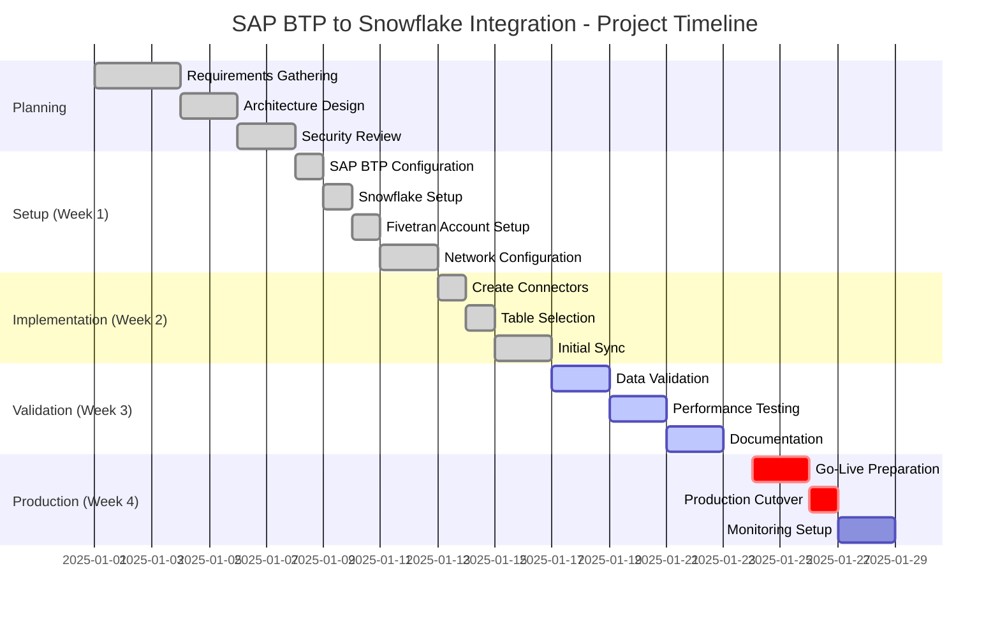
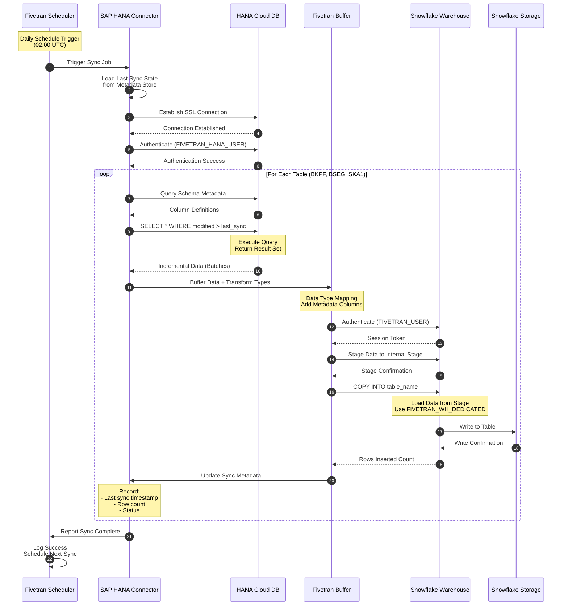
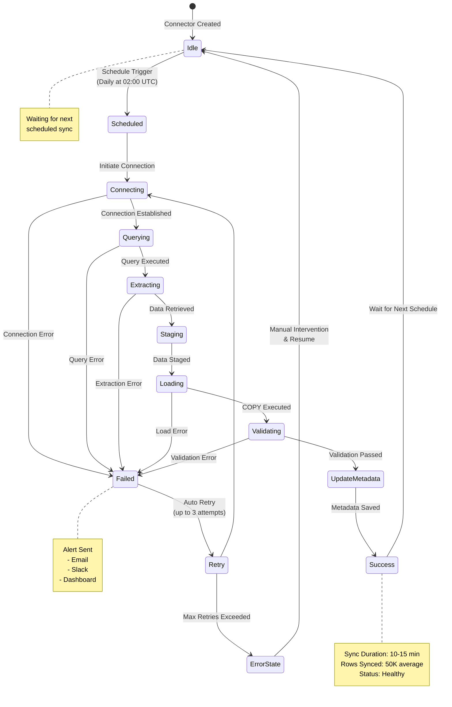
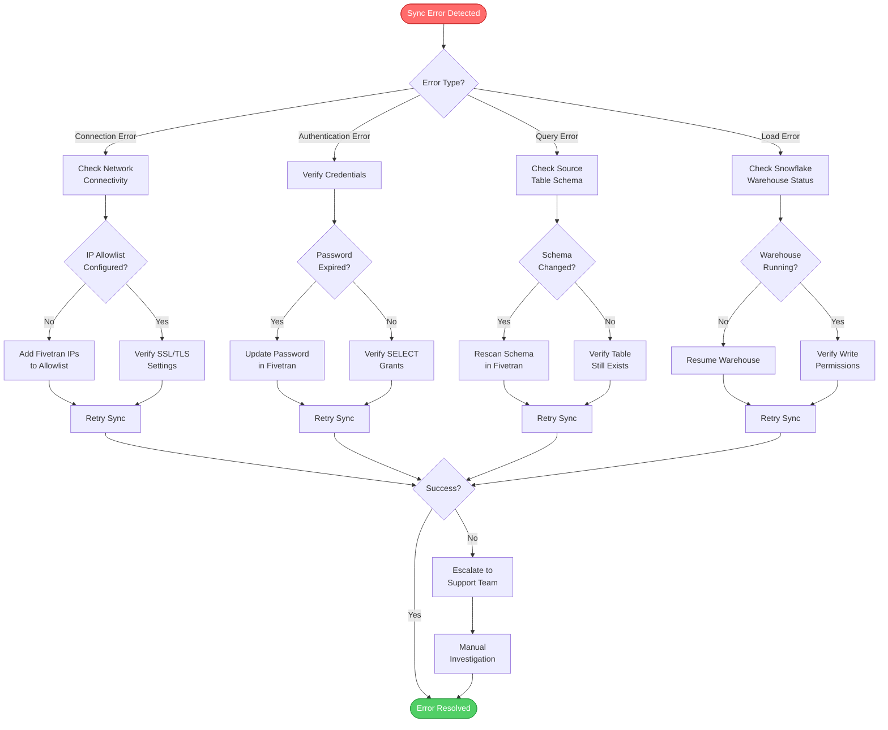
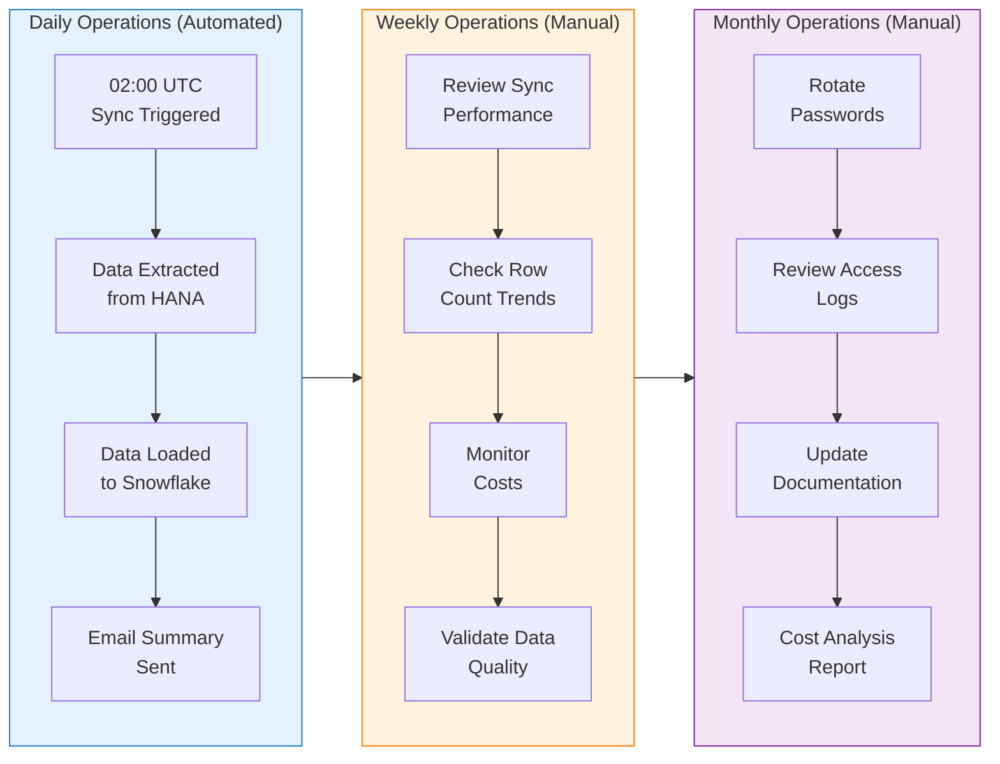
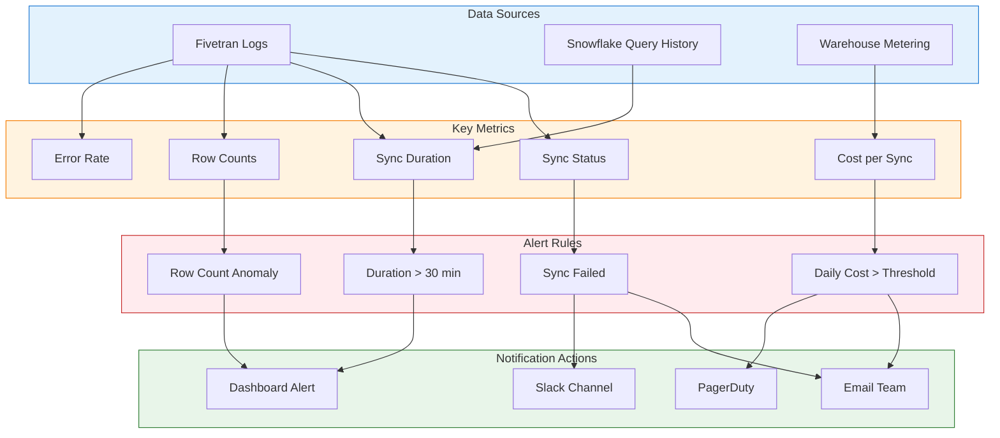

# Project Flow Documentation
## SAP BTP to Snowflake Data Integration Pipeline

**Documentation Type:** Implementation Flow Guide  
**Version:** 1.0  
**Author:** Research Student Implementation  
**Date:** October 2025

---

## Table of Contents
1. [Project Flow Overview](#project-flow-overview)
2. [Detailed Implementation Flow](#detailed-implementation-flow)
3. [Data Flow Diagrams](#data-flow-diagrams)
4. [Sync Cycle Flow](#sync-cycle-flow)
5. [Error Handling Flow](#error-handling-flow)
6. [Operational Workflows](#operational-workflows)

---

## Project Flow Overview

### End-to-End Project Timeline (Mermaid)



### High-Level Flow Diagram (ASCII)

```
┌──────────────────────────────────────────────────────────────────────┐
│                    PROJECT IMPLEMENTATION FLOW                       │
│                        (End-to-End Journey)                          │
└──────────────────────────────────────────────────────────────────────┘

PHASE 0: PRE-IMPLEMENTATION
═══════════════════════════════
┌─────────────────────┐
│ Gather Requirements │
│ • Tables needed     │
│ • Sync frequency    │
│ • Access approvals  │
└──────────┬──────────┘
           │
           ▼
┌─────────────────────┐
│ Obtain Credentials  │
│ • SAP BTP login     │
│ • Snowflake login   │
│ • Fivetran login    │
└──────────┬──────────┘
           │
           ▼
┌─────────────────────┐
│ Network Planning    │
│ • IP allowlist?     │
│ • Firewall rules    │
└──────────┬──────────┘
           │
           ════════════════════════════════════════
           
PHASE 1: SOURCE PREPARATION
═══════════════════════════════
           │
           ▼
┌──────────────────────────────┐
│ Access SAP BTP Cockpit       │
│ Navigate to HANA Cloud       │
└──────────┬───────────────────┘
           │
           ▼
┌──────────────────────────────┐
│ Open Database Explorer       │
│ Launch SQL Console           │
└──────────┬───────────────────┘
           │
           ▼
┌──────────────────────────────┐
│ CREATE FIVETRAN_HANA_USER    │
│ GRANT SELECT ON FINANCE      │
└──────────┬───────────────────┘
           │
           ▼
┌──────────────────────────────┐
│ Document Connection Info     │
│ • Host, Port, User, Pass     │
└──────────┬───────────────────┘
           │
           ════════════════════════════════════════

PHASE 2: TARGET PREPARATION
═══════════════════════════════
           │
           ▼
┌──────────────────────────────┐
│ Login to Snowflake           │
│ Open SQL Worksheet           │
└──────────┬───────────────────┘
           │
           ▼
┌──────────────────────────────┐
│ Execute Setup SQL            │
│ • CREATE ROLE                │
│ • CREATE WAREHOUSE           │
│   (Auto Suspend = 0)         │
│ • CREATE DATABASE/SCHEMA     │
│ • CREATE USER                │
│ • GRANT privileges           │
└──────────┬───────────────────┘
           │
           ▼
┌──────────────────────────────┐
│ Verify Warehouse Running     │
│ Check status = GREEN         │
└──────────┬───────────────────┘
           │
           ▼
┌──────────────────────────────┐
│ Document Connection Info     │
│ • Account, User, WH, DB      │
└──────────┬───────────────────┘
           │
           ════════════════════════════════════════

PHASE 3: INTEGRATION SETUP
═══════════════════════════════
           │
           ▼
┌──────────────────────────────┐
│ Login to Fivetran            │
│ Go to Destinations           │
└──────────┬───────────────────┘
           │
           ▼
┌──────────────────────────────┐
│ Add Snowflake Destination    │
│ Enter connection details     │
└──────────┬───────────────────┘
           │
           ▼
┌──────────────────────────────┐
│ Test Connection              │
│ Wait for "Success"           │
└──────────┬───────────────────┘
           │
           ▼
┌──────────────────────────────┐
│ Go to Connectors             │
│ Add SAP HANA Connector       │
└──────────┬───────────────────┘
           │
           ▼
┌──────────────────────────────┐
│ Enter HANA Credentials       │
│ Select Snowflake Destination │
└──────────┬───────────────────┘
           │
           ▼
┌──────────────────────────────┐
│ Test Connection              │
│ Wait for "Success"           │
└──────────┬───────────────────┘
           │
           ▼
┌──────────────────────────────┐
│ Select Tables (3-5 for POC)  │
│ • BKPF, BSEG, SKA1          │
└──────────┬───────────────────┘
           │
           ▼
┌──────────────────────────────┐
│ Configure Sync Frequency     │
│ Set to: Daily                │
└──────────┬───────────────────┘
           │
           ▼
┌──────────────────────────────┐
│ Start Initial Sync           │
│ Monitor Progress             │
└──────────┬───────────────────┘
           │
           ════════════════════════════════════════

PHASE 4: VALIDATION
═══════════════════════════════
           │
           ▼
┌──────────────────────────────┐
│ Wait for Sync Complete       │
│ Status = "Synced"            │
└──────────┬───────────────────┘
           │
           ▼
┌──────────────────────────────┐
│ Open Snowflake Worksheet     │
│ Query: SHOW TABLES           │
└──────────┬───────────────────┘
           │
           ▼
┌──────────────────────────────┐
│ Verify Tables Exist          │
│ Check row counts             │
└──────────┬───────────────────┘
           │
           ▼
┌──────────────────────────────┐
│ Sample Data Quality          │
│ SELECT * LIMIT 50            │
└──────────┬───────────────────┘
           │
           ▼
┌──────────────────────────────┐
│ Freshness Check              │
│ MAX(date_column)             │
└──────────┬───────────────────┘
           │
           ▼
┌──────────────────────────────┐
│ Performance Analysis         │
│ Check sync duration          │
└──────────┬───────────────────┘
           │
           ════════════════════════════════════════

PHASE 5: OPTIONAL ENHANCEMENTS
═══════════════════════════════
           │
           ▼
┌──────────────────────────────┐
│ Create Clean Views Schema    │
│ FINANCE_RAW_V                │
└──────────┬───────────────────┘
           │
           ▼
┌──────────────────────────────┐
│ Build Deduplication Views    │
│ ROW_NUMBER() pattern         │
└──────────┬───────────────────┘
           │
           ▼
┌──────────────────────────────┐
│ Tune Warehouse Size          │
│ Monitor costs                │
└──────────┬───────────────────┘
           │
           ▼
┌──────────────────────────────┐
│ Setup Monitoring/Alerts      │
│ Email/Slack notifications    │
└──────────┬───────────────────┘
           │
           ════════════════════════════════════════

PHASE 6: PRODUCTION READY
═══════════════════════════════
           │
           ▼
┌──────────────────────────────┐
│ Document Everything          │
│ Create runbooks              │
└──────────┬───────────────────┘
           │
           ▼
┌──────────────────────────────┐
│ Hand-off to Operations       │
│ Schedule: Daily syncs        │
└──────────┬───────────────────┘
           │
           ▼
         [END]
     Production Live
```

---

## Detailed Implementation Flow

### Sequential Step Flow (Mermaid)

```mermaid
flowchart TD
    Start([Start: Project Kickoff]) --> Req{Requirements<br/>Clear?}
    Req -->|No| Gather[Gather Requirements]
    Gather --> Req
    Req -->|Yes| Creds{All Credentials<br/>Available?}
    
    Creds -->|No| ObtainAccess[Obtain Access<br/>to Systems]
    ObtainAccess --> Creds
    Creds -->|Yes| SAPSetup[SAP BTP Setup]
    
    SAPSetup --> CreateUser[Create HANA User<br/>FIVETRAN_HANA_USER]
    CreateUser --> GrantSelect[GRANT SELECT<br/>on FINANCE Schema]
    GrantSelect --> DocHANA[Document HANA<br/>Connection Details]
    
    DocHANA --> SFSetup[Snowflake Setup]
    SFSetup --> CreateWH[CREATE Warehouse<br/>Auto Suspend = 0]
    CreateWH --> CreateDB[CREATE Database<br/>& Schema]
    CreateDB --> CreateSFUser[CREATE Snowflake User<br/>& Role]
    CreateSFUser --> GrantSF[GRANT Privileges]
    GrantSF --> VerifyWH{Warehouse<br/>Running?}
    
    VerifyWH -->|No| StartWH[Resume Warehouse]
    StartWH --> VerifyWH
    VerifyWH -->|Yes| DocSF[Document Snowflake<br/>Connection Details]
    
    DocSF --> FTDest[Create Fivetran<br/>Destination]
    FTDest --> TestDest{Connection<br/>Test OK?}
    TestDest -->|No| FixDest[Fix Credentials/<br/>Network Issues]
    FixDest --> FTDest
    TestDest -->|Yes| FTConn[Create SAP HANA<br/>Connector]
    
    FTConn --> TestConn{Connection<br/>Test OK?}
    TestConn -->|No| FixConn[Fix Credentials/<br/>IP Allowlist]
    FixConn --> FTConn
    TestConn -->|Yes| SelectTables[Select Tables<br/>3-5 for POC]
    
    SelectTables --> SetFreq[Set Sync Frequency<br/>to Daily]
    SetFreq --> InitSync[Start Initial Sync]
    InitSync --> Monitor[Monitor Progress]
    
    Monitor --> SyncDone{Sync<br/>Complete?}
    SyncDone -->|No| CheckError{Errors?}
    CheckError -->|Yes| Troubleshoot[Troubleshoot<br/>& Retry]
    Troubleshoot --> InitSync
    CheckError -->|No| Monitor
    SyncDone -->|Yes| Validate[Run Validation<br/>Queries]
    
    Validate --> ValidCheck{Data Valid?}
    ValidCheck -->|No| Investigate[Investigate<br/>Data Issues]
    Investigate --> ValidCheck
    ValidCheck -->|Yes| Optional{Need Clean<br/>Views?}
    
    Optional -->|Yes| CreateViews[Create Views<br/>Schema]
    CreateViews --> BuildViews[Build Dedup<br/>Views]
    BuildViews --> Done
    Optional -->|No| Done
    
    Done([End: Production Ready])
    
    style Start fill:#4CAF50,stroke:#2E7D32,color:#fff
    style Done fill:#4CAF50,stroke:#2E7D32,color:#fff
    style Req fill:#FFC107,stroke:#F57C00,color:#000
    style Creds fill:#FFC107,stroke:#F57C00,color:#000
    style TestDest fill:#FFC107,stroke:#F57C00,color:#000
    style TestConn fill:#FFC107,stroke:#F57C00,color:#000
    style SyncDone fill:#FFC107,stroke:#F57C00,color:#000
    style ValidCheck fill:#FFC107,stroke:#F57C00,color:#000
```



---

## Data Flow Diagrams

### Batch Sync Data Flow (Mermaid)



### Data Transformation Flow (ASCII)

```
┌──────────────────────────────────────────────────────────────────┐
│                  DATA TRANSFORMATION FLOW                        │
│              (SAP HANA → Snowflake Mapping)                      │
└──────────────────────────────────────────────────────────────────┘

SOURCE: SAP HANA FINANCE.BKPF
══════════════════════════════════
┌────────────────────────────────┐
│ Column Name  │ HANA Type       │
├──────────────┼─────────────────┤
│ BUKRS        │ NVARCHAR(4)     │
│ BELNR        │ NVARCHAR(10)    │
│ GJAHR        │ NVARCHAR(4)     │
│ BUDAT        │ DATE            │
│ BLART        │ NVARCHAR(2)     │
│ WRBTR        │ DECIMAL(15,2)   │
│ CPUDT        │ DATE            │
│ CPUTM        │ TIME            │
│ USNAM        │ NVARCHAR(12)    │
└────────────────────────────────┘
           │
           │ Fivetran Extraction
           ▼
IN-FLIGHT TRANSFORMATION
═══════════════════════════════════
┌────────────────────────────────┐
│ TRANSFORMATION LOGIC:          │
│                                │
│ 1. Data Type Mapping:          │
│    NVARCHAR → VARCHAR          │
│    DATE → DATE                 │
│    TIME → TIME                 │
│    DECIMAL → NUMBER            │
│                                │
│ 2. Add Metadata:               │
│    _FIVETRAN_SYNCED            │
│      = CURRENT_TIMESTAMP()     │
│    _FIVETRAN_DELETED           │
│      = FALSE (default)         │
│                                │
│ 3. Encoding:                   │
│    UTF-8 standardization       │
│                                │
│ 4. NULL Handling:              │
│    Preserve NULL values        │
│                                │
└────────────────────────────────┘
           │
           │ Bulk Load
           ▼
TARGET: SNOWFLAKE FINANCE_RAW.BKPF
═════════════════════════════════════
┌─────────────────────────────────────┐
│ Column Name          │ Snowflake    │
│                      │ Type         │
├──────────────────────┼──────────────┤
│ BUKRS                │ VARCHAR(4)   │
│ BELNR                │ VARCHAR(10)  │
│ GJAHR                │ VARCHAR(4)   │
│ BUDAT                │ DATE         │
│ BLART                │ VARCHAR(2)   │
│ WRBTR                │ NUMBER(15,2) │
│ CPUDT                │ DATE         │
│ CPUTM                │ TIME         │
│ USNAM                │ VARCHAR(12)  │
│ _FIVETRAN_SYNCED     │ TIMESTAMP_NTZ│ ← Added
│ _FIVETRAN_DELETED    │ BOOLEAN      │ ← Added
└─────────────────────────────────────┘
           │
           │ Optional: View Layer
           ▼
CONSUMPTION: FINANCE_RAW_V.BKPF_CLEAN
═════════════════════════════════════════
┌─────────────────────────────────────┐
│ VIEW LOGIC:                         │
│                                     │
│ SELECT *                            │
│ FROM (                              │
│   SELECT t.*,                       │
│     ROW_NUMBER() OVER (             │
│       PARTITION BY BELNR            │
│       ORDER BY _FIVETRAN_SYNCED DESC│
│     ) AS rn                         │
│   FROM FINANCE_RAW.BKPF t           │
│   WHERE _FIVETRAN_DELETED = FALSE   │
│ )                                   │
│ WHERE rn = 1                        │
│                                     │
│ RESULT: Latest version of each      │
│         document, deduplicated      │
└─────────────────────────────────────┘
```

---

## Sync Cycle Flow

### Daily Sync Cycle (Mermaid)



### Incremental vs Full Load Decision Flow (ASCII)

```
┌──────────────────────────────────────────────────────────────────┐
│           SYNC MODE DECISION FLOW                                │
└──────────────────────────────────────────────────────────────────┘

                    ┌─────────────────┐
                    │  Sync Triggered │
                    └────────┬─────────┘
                             │
                             ▼
                    ┌─────────────────┐
                    │ Check Metadata  │
                    │ Store for Table │
                    └────────┬─────────┘
                             │
                ┌────────────┴────────────┐
                │                         │
                ▼                         ▼
        ┌───────────────┐         ┌──────────────┐
        │ First Sync?   │         │ Schema       │
        │ (No metadata) │         │ Changed?     │
        └───────┬───────┘         └──────┬───────┘
                │                        │
                │ YES                    │ YES
                │                        │
                ▼                        ▼
        ┌──────────────────────────────────────┐
        │      FULL LOAD (Historical Sync)     │
        ├──────────────────────────────────────┤
        │ Query: SELECT * FROM table           │
        │ Mode: Snapshot                       │
        │ Strategy: Load all rows              │
        │ Duration: Longer (30-60 min)         │
        │ Cost: Higher (more data transfer)    │
        └──────────────┬───────────────────────┘
                       │
                       │
                ┌──────┴───────┐
                │              │
                ▼              ▼
        NO (has metadata)   NO (schema same)
                │              │
                └──────┬───────┘
                       │
                       ▼
        ┌──────────────────────────────────────┐
        │    INCREMENTAL SYNC (Delta Load)     │
        ├──────────────────────────────────────┤
        │ Query: SELECT * FROM table           │
        │        WHERE modified > :last_sync   │
        │ Mode: Incremental                    │
        │ Strategy: Load changed rows only     │
        │ Duration: Faster (5-15 min)          │
        │ Cost: Lower (less data transfer)     │
        └──────────────┬───────────────────────┘
                       │
                       ▼
        ┌──────────────────────────────────────┐
        │     Update Metadata Store            │
        │  • last_sync_timestamp = NOW()       │
        │  • rows_synced = count               │
        │  • sync_status = SUCCESS             │
        └──────────────┬───────────────────────┘
                       │
                       ▼
                  [Complete]

┌──────────────────────────────────────────────────────────────────┐
│  SYNC MODE CHARACTERISTICS                                       │
├──────────────────────────────────────────────────────────────────┤
│                                                                  │
│  FULL LOAD                                                       │
│  ┌────────────────────────────────────────────────────────┐     │
│  │ Trigger Conditions:                                    │     │
│  │ • First sync of new table                              │     │
│  │ • Schema change detected                               │     │
│  │ • Manual resync requested                              │     │
│  │ • Incremental sync consistently failing               │     │
│  │                                                        │     │
│  │ Example (BKPF table):                                  │     │
│  │ • Rows: 2,000,000                                      │     │
│  │ • Size: 500 MB                                         │     │
│  │ • Duration: ~25 minutes (SMALL warehouse)              │     │
│  │ • Network: ~20 MB/min transfer rate                    │     │
│  └────────────────────────────────────────────────────────┘     │
│                                                                  │
│  INCREMENTAL LOAD                                                │
│  ┌────────────────────────────────────────────────────────┐     │
│  │ Trigger Conditions:                                    │     │
│  │ • Scheduled sync (not first time)                      │     │
│  │ • Schema unchanged                                     │     │
│  │ • Metadata available                                   │     │
│  │                                                        │     │
│  │ Example (BKPF daily changes):                          │     │
│  │ • Rows: 50,000 (2.5% of total)                         │     │
│  │ • Size: 12 MB                                          │     │
│  │ • Duration: ~10 minutes (SMALL warehouse)              │     │
│  │ • Network: ~1.2 MB/min transfer rate                   │     │
│  │                                                        │     │
│  │ Efficiency Gain: 60% faster, 98% less data            │     │
│  └────────────────────────────────────────────────────────┘     │
│                                                                  │
└──────────────────────────────────────────────────────────────────┘
```

---

## Error Handling Flow

### Error Resolution Flowchart (Mermaid)



### Error Handling Matrix (ASCII)

```
┌──────────────────────────────────────────────────────────────────────┐
│                   ERROR HANDLING MATRIX                              │
└──────────────────────────────────────────────────────────────────────┘

┌─────────────────┬────────────────────┬──────────────────┬────────────┐
│ Error Type      │ Symptoms           │ Resolution       │ Auto-Retry │
├─────────────────┼────────────────────┼──────────────────┼────────────┤
│ Connection      │ • Cannot reach     │ • Check firewall │ YES (3x)   │
│ Timeout         │   host             │ • Verify IP      │ 5 min delay│
│                 │ • "Timeout"        │   allowlist      │            │
│                 │   message          │ • Test network   │            │
│                 │                    │   connectivity   │            │
├─────────────────┼────────────────────┼──────────────────┼────────────┤
│ Authentication  │ • "Invalid         │ • Verify user/   │ NO         │
│ Failure         │   credentials"     │   password       │ Manual fix │
│                 │ • "Access denied"  │ • Reset password │ required   │
│                 │                    │ • Check grants   │            │
├─────────────────┼────────────────────┼──────────────────┼────────────┤
│ Schema Change   │ • "Column not      │ • Rescan schema  │ YES (1x)   │
│                 │   found"           │   in Fivetran    │ Auto-      │
│                 │ • "Table not       │ • Update table   │ rescan     │
│                 │   found"           │   selection      │            │
├─────────────────┼────────────────────┼──────────────────┼────────────┤
│ Insufficient    │ • "Permission      │ • Grant missing  │ NO         │
│ Privileges      │   denied"          │   privileges     │ Manual fix │
│                 │ • "Cannot SELECT"  │ • Verify role    │ required   │
│                 │                    │   assignments    │            │
├─────────────────┼────────────────────┼──────────────────┼────────────┤
│ Warehouse       │ • "Warehouse not   │ • Resume WH      │ YES (3x)   │
│ Suspended       │   running"         │ • Check auto-    │ 2 min delay│
│                 │ • Load timeout     │   suspend config │            │
├─────────────────┼────────────────────┼──────────────────┼────────────┤
│ Data Type       │ • "Type mismatch"  │ • Check type     │ NO         │
│ Mismatch        │ • "Conversion      │   mappings       │ Needs      │
│                 │   error"           │ • Update schema  │ manual     │
│                 │                    │                  │ mapping    │
├─────────────────┼────────────────────┼──────────────────┼────────────┤
│ Quota Exceeded  │ • "Storage full"   │ • Increase       │ NO         │
│                 │ • "Credit limit"   │   quota/credits  │ Requires   │
│                 │                    │ • Clean old data │ action     │
├─────────────────┼────────────────────┼──────────────────┼────────────┤
│ Network         │ • Intermittent     │ • Check network  │ YES (5x)   │
│ Instability     │   disconnects      │   stability      │ 10 min     │
│                 │ • "Connection      │ • Contact ISP    │ delay      │
│                 │   reset"           │                  │            │
└─────────────────┴────────────────────┴──────────────────┴────────────┘

ESCALATION PATH:
════════════════════════════════════════════════════════════════════════

Level 1: Automatic Retry (5-15 minutes)
  │
  ├─ Transient errors (network, timeouts)
  └─ Auto-resolved in 80% of cases
       │
       │ [If unresolved after 3 retries]
       ▼
Level 2: Alert Notification (Email/Slack)
  │
  ├─ Project team notified
  ├─ Check Fivetran dashboard for details
  └─ Follow troubleshooting guide
       │
       │ [If unresolved after 2 hours]
       ▼
Level 3: Manual Investigation
  │
  ├─ Review error logs
  ├─ Check system status pages
  │   • SAP BTP status
  │   • Fivetran status
  │   • Snowflake status
  └─ Apply fixes from troubleshooting matrix
       │
       │ [If unresolved after 4 hours]
       ▼
Level 4: Vendor Support Escalation
  │
  ├─ Open ticket with Fivetran support
  ├─ Provide: logs, connector ID, error messages
  └─ Target response: 4 business hours (standard tier)
```

---

## Operational Workflows

### Daily Operations Workflow (Mermaid)



### Maintenance Workflow (ASCII)

```
┌──────────────────────────────────────────────────────────────────┐
│                  MAINTENANCE WORKFLOWS                           │
└──────────────────────────────────────────────────────────────────┘

WORKFLOW 1: ADD NEW TABLE TO SYNC
═══════════════════════════════════════
┌─────────────────────────┐
│ 1. Verify Table Access  │
│    • Login to HANA      │
│    • Check table exists │
│    • Test SELECT query  │
└──────────┬──────────────┘
           │
           ▼
┌─────────────────────────┐
│ 2. Grant Permissions    │
│    • GRANT SELECT       │
│      to FIVETRAN_USER   │
└──────────┬──────────────┘
           │
           ▼
┌─────────────────────────┐
│ 3. Rescan in Fivetran   │
│    • Connector → Schema │
│    • Click "Rescan"     │
└──────────┬──────────────┘
           │
           ▼
┌─────────────────────────┐
│ 4. Enable Table         │
│    • Toggle ON          │
│    • Click "Save"       │
└──────────┬──────────────┘
           │
           ▼
┌─────────────────────────┐
│ 5. Monitor Initial Sync │
│    • Watch progress bar │
│    • Check for errors   │
└──────────┬──────────────┘
           │
           ▼
┌─────────────────────────┐
│ 6. Validate in Snowflake│
│    • Check table exists │
│    • Query row count    │
└──────────┬──────────────┘
           │
           ▼
         [Done]

WORKFLOW 2: CHANGE SYNC FREQUENCY
═══════════════════════════════════════
┌─────────────────────────┐
│ 1. Assess Impact        │
│    • Current: Daily     │
│    • Proposed: Hourly   │
│    • Cost impact?       │
└──────────┬──────────────┘
           │
           ▼
┌─────────────────────────┐
│ 2. Check WH Capacity    │
│    • Current size: SMALL│
│    • Need to scale up?  │
└──────────┬──────────────┘
           │
           ▼
┌─────────────────────────┐
│ 3. Update in Fivetran   │
│    • Connector → Setup  │
│    • Sync Frequency     │
│    • Select: Hourly     │
│    • Save               │
└──────────┬──────────────┘
           │
           ▼
┌─────────────────────────┐
│ 4. Monitor First 24h    │
│    • Check all syncs OK │
│    • Review performance │
└──────────┬──────────────┘
           │
           ▼
┌─────────────────────────┐
│ 5. Document Change      │
│    • Update runbook     │
│    • Notify team        │
└──────────┬──────────────┘
           │
           ▼
         [Done]

WORKFLOW 3: SCALE WAREHOUSE
═══════════════════════════════════════
┌─────────────────────────┐
│ 1. Review Performance   │
│    • Sync duration      │
│    • Query for metrics  │
└──────────┬──────────────┘
           │
           ▼
┌─────────────────────────┐
│ 2. Calculate Cost Delta │
│    • SMALL: 2 cred/hr   │
│    • MEDIUM: 4 cred/hr  │
│    • Delta: +2 cred/hr  │
└──────────┬──────────────┘
           │
           ▼
┌─────────────────────────┐
│ 3. Execute ALTER        │
│    ALTER WAREHOUSE      │
│    SET SIZE = 'MEDIUM'  │
└──────────┬──────────────┘
           │
           ▼
┌─────────────────────────┐
│ 4. Trigger Manual Sync  │
│    • Test new size      │
│    • Measure duration   │
└──────────┬──────────────┘
           │
           ▼
┌─────────────────────────┐
│ 5. Monitor & Decide     │
│    • Keep new size?     │
│    • Revert if no gain  │
└──────────┬──────────────┘
           │
           ▼
         [Done]

WORKFLOW 4: PASSWORD ROTATION
═══════════════════════════════════════
┌─────────────────────────┐
│ 1. Generate New Pwd     │
│    • Strong password    │
│    • 16+ characters     │
└──────────┬──────────────┘
           │
           ▼
┌─────────────────────────┐
│ 2. Update in HANA       │
│    ALTER USER           │
│    FIVETRAN_HANA_USER   │
│    PASSWORD 'new'       │
└──────────┬──────────────┘
           │
           ▼
┌─────────────────────────┐
│ 3. Update in Fivetran   │
│    • Connector → Setup  │
│    • Update password    │
│    • Test connection    │
└──────────┬──────────────┘
           │
           ▼
┌─────────────────────────┐
│ 4. Repeat for Snowflake │
│    • ALTER USER in SF   │
│    • Update Destination │
│    • Test connection    │
└──────────┬──────────────┘
           │
           ▼
┌─────────────────────────┐
│ 5. Verify Next Sync     │
│    • Wait for scheduled │
│    • Confirm success    │
└──────────┬──────────────┘
           │
           ▼
         [Done]
```

---

## Monitoring and Observability Flow

### Monitoring Dashboard Flow (Mermaid)



---

## Summary

### Project Flow Success Criteria

```
┌──────────────────────────────────────────────────────────────────┐
│               SUCCESS CRITERIA CHECKLIST                         │
└──────────────────────────────────────────────────────────────────┘

PHASE 1: Setup Complete
  ✓ SAP HANA user created with SELECT privileges
  ✓ Snowflake warehouse running (Auto Suspend = 0)
  ✓ Database, schema, user, role configured
  ✓ Fivetran destination connection test passed
  ✓ Fivetran connector connection test passed

PHASE 2: Initial Sync Complete
  ✓ 3-5 tables selected
  ✓ Initial sync completed without errors
  ✓ All tables visible in Snowflake
  ✓ Row counts match expectations
  ✓ Sync duration < 60 minutes

PHASE 3: Validation Passed
  ✓ Sample queries return correct data
  ✓ Data types mapped correctly
  ✓ Freshness check shows recent data
  ✓ No data corruption or truncation
  ✓ Metadata columns present (_FIVETRAN_SYNCED, _FIVETRAN_DELETED)

PHASE 4: Operational Readiness
  ✓ Daily sync schedule active
  ✓ Email alerts configured
  ✓ Monitoring queries documented
  ✓ Troubleshooting runbook created
  ✓ Team trained on operations

PHASE 5: Production Ready
  ✓ 3 consecutive successful syncs
  ✓ Performance within SLA (< 15 minutes)
  ✓ Cost tracking enabled
  ✓ Documentation complete
  ✓ Stakeholder sign-off obtained
```

---

**Document Version:** 1.0  
**Last Updated:** October 2025  
**Next Review:** January 2026  
**Owner:** Research Student Implementation Team  
**Status:** Production Ready

